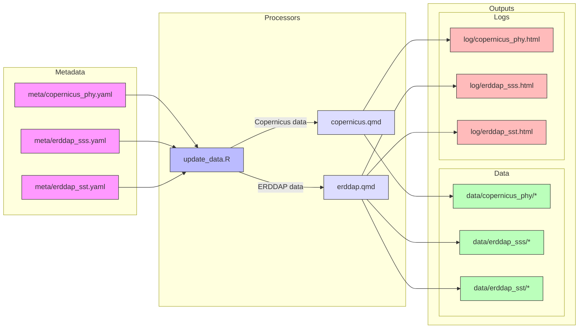

# climate-dashboard-app

Shiny app for climate dashboard

- app: <https://shiny.marinebon.app/nms-cc>
- log: <https://noaa-onms.github.io/climate-dashboard-app>

## Data Extraction

Metadata for datasets (`/meta/*.yaml`) are used by the update script 
(`process/update_data.R`), which uses dataset-specific Quarto notebooks
(`process/copernicus|erddap.qmd`) to generate the data files (`/data/*`) 
and the log files (`/log/*.html`). These are run daily (`process/update_data.R`)
by a cron job on the server and consumed by the [app](https://shiny.marinebon.app/nms-cc).

The data processing workflow follows this pattern:

```
meta/erddap_sst.yaml -[ erddap.qmd ]-> data/erddap_sst/*, log/erddap_sst.html
```

This process is illustrated in the diagram below:



The workflow consists of these key steps:

1. **Configuration**: Metadata YAML files in `/meta/` define dataset parameters
2. **Processing**: The `update_data.R` script reads metadata and determines which Quarto notebook to use
3. **Data Generation**: Either `copernicus.qmd` or `erddap.qmd` notebooks process the raw data sources
4. **Output**: Generated datasets are stored in `/data/` with corresponding processing logs in `/log/`

### File Structure

```
project/
├── meta/
│   ├── copernicus_phy.yaml
│   ├── erddap_sss.yaml
│   └── erddap_sst.yaml
├── process/
│   ├── copernicus.qmd
│   ├── erddap.qmd
│   └── update_data.R
├── data/
│   ├── copernicus_phy/
│   │   ├── 2010.csv
│   │   ├── 2010.tif
│   │   ├── 2011.csv
│   │   └── 2011.tif
│   ├── erddap_sst/
│   │   ├── 2010.csv
│   │   ├── 2010.tif
│   │   ├── 2011.csv
│   │   └── 2011.tif
│   └── erddap_sss/
│   │   ├── 2010.csv
│   │   ├── 2010.tif
│   │   ├── 2011.csv
│   │   └── 2011.tif
└── log/
    ├── copernicus_phy.html
    ├── erddap_sss.html
    └── erddap_sst.html
```

## Extracting individual dataset variables

Data is stored in `/data/` and checked into Github.
The 
[`extractr::ed_extract()`](https://marinebon.github.io/extractr/reference/ed_extract.html) 
function is used to fetch ERDDAP data and save it to this location.
Add a metada file to `meta/*.yml` to add more variables from an ERDDAP server.

Run for variables of interest:

```bash
quarto render process/extractr.qmd --execute-params meta/erddap_sst.yaml
```

Alternatively: edit the `params` header in the `extractr.qmd` file itself & run from RStudio.

## TODO

- TODO: Add configurations to yml to use the data in the app (`global.R`).
