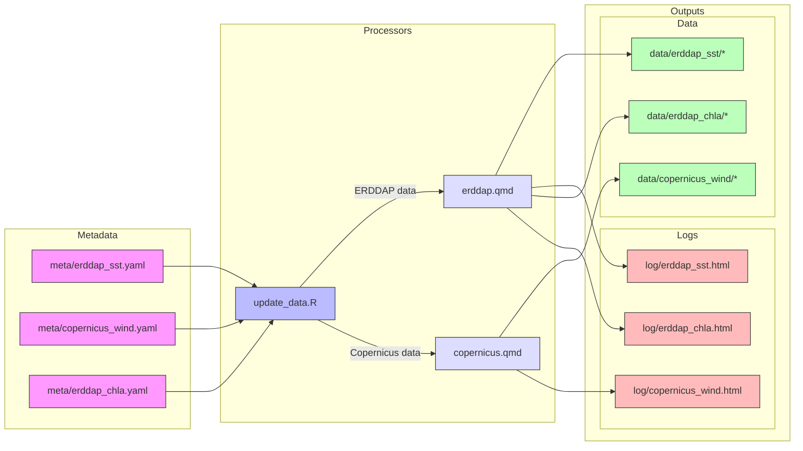
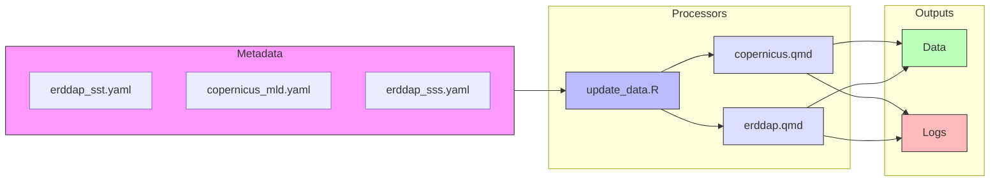

# climate-dashboard-app

Shiny app for climate dashboard

- app: <https://shiny.marinebon.app/nms-cc>
- log: <https://noaa-onms.github.io/climate-dashboard-app>

## data processing

Metadata for datasets (`/meta/*.yaml`) are used by the update script 
(`process/update_data.R`), which uses dataset-specific Quarto notebooks
(`process/copernicus|erddap.qmd`) to generate the data files (`/data/*`) 
and the log files (`/log/*.html`), eg:

```
meta/erddap_sst.yaml -[ erddap.qmd ]-> data/erddap_sst/*, log/erddap_sst.html
```

I'll update the README.md section to include a more detailed tree-like file structure and add a Mermaid diagram to better explain the data processing workflow. Here's my updated version:

## Data Processing

Metadata for datasets (`/meta/*.yaml`) are used by the update script (`process/update_data.R`), which uses dataset-specific Quarto notebooks (`process/copernicus|erddap.qmd`) to generate the data files (`/data/*`) and the log files (`/log/*.html`).

### File Structure

```
project/
├── meta/
│   ├── copernicus_mld.yaml
│   ├── erddap_sss.yaml
│   └── erddap_sst.yaml
├── process/
│   ├── copernicus.qmd
│   ├── erddap.qmd
│   └── update_data.R
├── data/
│   ├── copernicus_mld/
│   │   ├── 2010.csv
│   │   ├── 2010.tif
│   │   ├── 2011.csv
│   │   └── 2011.tif
│   ├── erddap_sst/
│   │   ├── 2010.csv
│   │   ├── 2010.tif
│   │   ├── 2011.csv
│   │   └── 2011.tif
│   └── erddap_sss/
│   │   ├── 2010.csv
│   │   ├── 2010.tif
│   │   ├── 2011.csv
│   │   └── 2011.tif
└── log/
    ├── copernicus_mld.html
    ├── erddap_sss.html
    └── erddap_sst.html
```

### Data Processing Workflow

The data processing workflow follows this pattern:

```
meta/erddap_sst.yaml -[ erddap.qmd ]-> data/erddap_sst/*, log/erddap_sst.html
```

This process is illustrated in the diagram below:






The workflow consists of these key steps:

1. **Configuration**: Metadata YAML files in `/meta/` define dataset parameters
2. **Processing**: The `update_data.R` script reads metadata and determines which Quarto notebook to use
3. **Data Generation**: Either `copernicus.qmd` or `erddap.qmd` notebooks process the raw data sources
4. **Output**: Generated datasets are stored in `/data/` with corresponding processing logs in `/log/`

Here are the latest output log files:

<!-- Jekyll render html in log/*.html -->

  
* [{{ file.basename }}]({{ site.baseurl }}{{ file.path }})
  


## source

See [github.com/MarineSensitivity/workflows](https://github.com/MarineSensitivity/workflows)


- [logs](./log)

# install

```bash
# install data repo
git clone git@github.com:noaa-onms/climate-dashboard.git\

# install this repo
git clone git@github.com:noaa-onms/climate-dashboard-app.git
```

# Add Variable Data
Data is stored in `/data/` and checked into github.
Installation of data isn't needed unless more variables are being added.
`extractr` is used to fetch data and save it to this location.
Modify `extractr.qmd` to add more variables from an ERDDAP server.
To run this `.qmd` you will need to put the extractr pacakage one directory level up from this repo (`../`).

```bash
cd ..
git clone git@github.com:marinebon/extractr.git
```

Run for variables of interest:

```bash
quarto render extractr.qmd --execute-params data/metadata/erddap_dhw.yaml
```

This will take a long time and show little output. 
NOTE: Cannot get more verbose, even using `--execute-debug --log-level info --output -`.

Alternatively: edit the `params` header in the `extractr.qmd` file itself & run from RStudio.

The ability to **use** this data is not yet coded into global.R, server.R, and ui.R.
